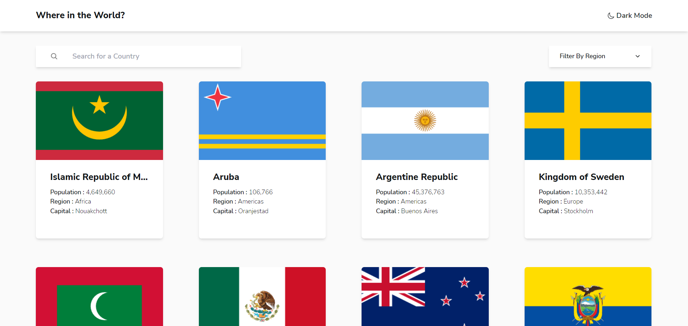
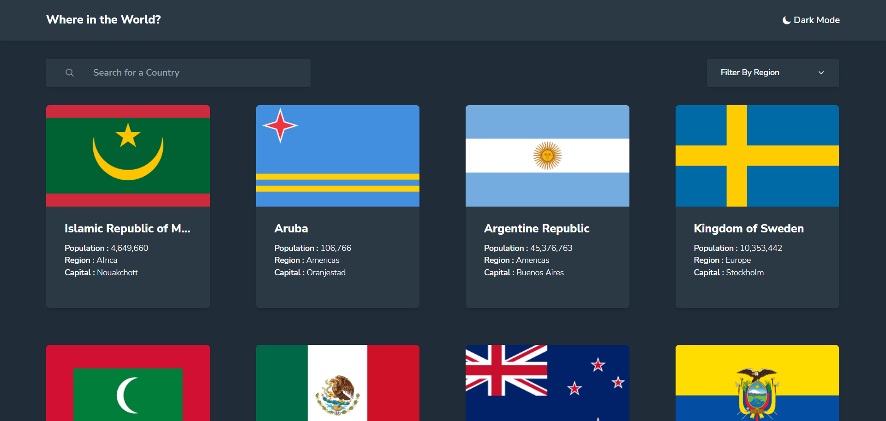
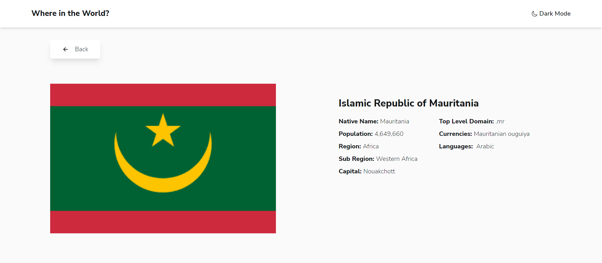

# Frontend Mentor - REST Countries API with color theme switcher solution

This is a solution to the [REST Countries API with color theme switcher challenge on Frontend Mentor](https://www.frontendmentor.io/challenges/rest-countries-api-with-color-theme-switcher-5cacc469fec04111f7b848ca). Frontend Mentor challenges help you improve your coding skills by building realistic projects.

## Table of contents

- [Overview](#overview)
  - [The challenge](#the-challenge)
  - [Screenshot](#screenshot)
- [My process](#my-process)
  - [Built with](#built-with)
  - [What I learned](#what-i-learned)
- [Author](#author)

## Overview

### The challenge

Users should be able to:

- See all countries from the API on the homepage
- Search for a country using an `input` field
- Filter countries by region
- Click on a country to see more detailed information on a separate page
- Click through to the border countries on the detail page
- Toggle the color scheme between light and dark mode

### Screenshot

### Links

- Solution URL: [Solution](https://github.com/shashank20-02/REST_countries_API_with_color_theme/)
- Live Site URL: [Live Site](https://master--rad-narwhal-77521c.netlify.app/)

## My process

- Completed.

### Built with

- React Js
- Flexbox
- CSS Grid
- Mobile-first workflow
- [React](https://reactjs.org/) - JS library
- [TailwindCSS](https://tailwindcss.com/)

### What I learned

Enhanced my Knowledge to deal with REST API's and React Redux.

## Author

- Website - [Shashank Sharma]
- Frontend Mentor - [@shashank20-02](https://www.frontendmentor.io/profile/shashank20-02)
- Github - [@shashank20-02](https://www.github.com/shashank20-02)
